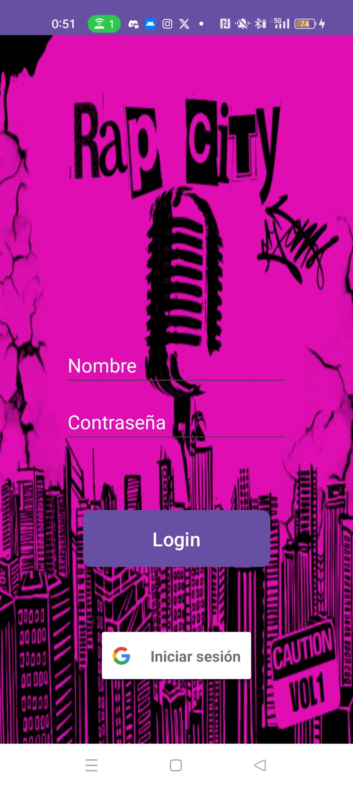
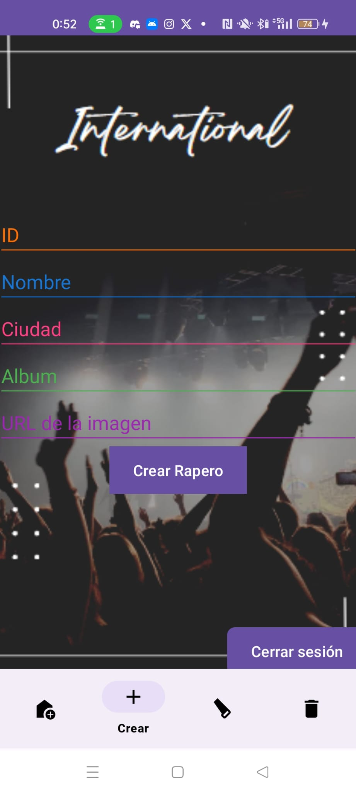
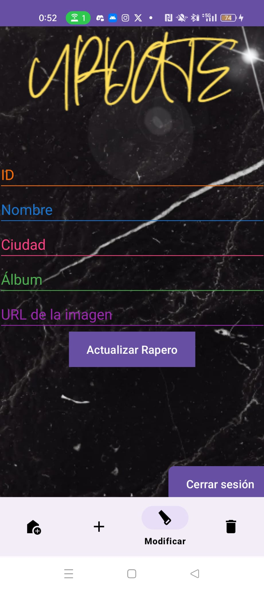
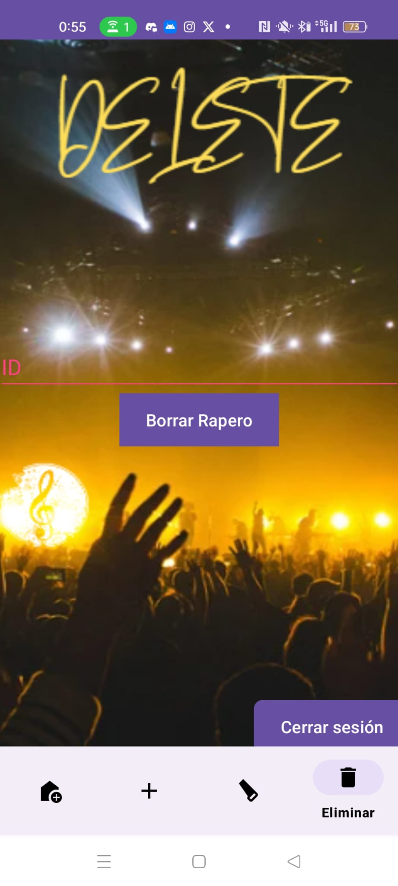

**Proyecto Final Multimedia - Aplicación Android**

**Descripción**
Este proyecto consiste en una aplicación Android desarrollada como parte del proyecto final del curso de Multimedia. La aplicación se encarga de interactuar con una API RESTful de raperos para mostrar información sobre ellos y permitir a los usuarios realizar operaciones CRUD (Crear, Leer, Actualizar, Borrar) sobre la base de datos de raperos.

**Características Principales**
Visualización de lista de raperos con sus detalles.
Creación de nuevos raperos.
Modificación de información de raperos existentes.
Eliminación de raperos de la base de datos.

**API de Raperos**
La aplicación Android consume una API RESTful de raperos, la cual proporciona endpoints para realizar operaciones CRUD sobre la base de datos de raperos. Algunos detalles sobre la API incluyen:

**Tecnología Utilizada:** La API está desarrollada utilizando Spring Boot.
**Funcionalidades:** Ofrece endpoints para obtener la lista de raperos, crear nuevos raperos, actualizar la información de raperos existentes y eliminar raperos.
**Documentación:** La documentación de la API se puede encontrar en API de Raperos.

**Proyecto Android**
La aplicación Android se ha desarrollado utilizando el entorno de desarrollo Android Studio y está escrita en Java. A continuación, se detallan las principales funcionalidades y componentes del proyecto:

**Actividades y Fragmentos:** La interfaz de usuario se compone de actividades principales y fragmentos para mostrar diferentes vistas y funcionalidades.
**Consumo de API:** Se utiliza Retrofit para realizar llamadas a la API de raperos y obtener los datos necesarios para mostrar en la aplicación.
**Adaptadores y ListViews:** Se implementan adaptadores personalizados para mostrar la lista de raperos y sus detalles en ListViews.
**Operaciones CRUD:** Se implementan funciones para realizar operaciones CRUD sobre la base de datos de raperos, como crear, leer, actualizar y eliminar.

**Dependencias**
El proyecto utiliza varias bibliotecas y dependencias para su funcionamiento. A continuación, se detallan las principales dependencias utilizadas:

**AndroidX Appcompat:** Una biblioteca de compatibilidad que facilita el uso de características más nuevas en versiones anteriores de Android.
**Material Components para Android:** Proporciona una implementación de los componentes de Material Design.
**ConstraintLayout:** Biblioteca de diseño flexible para crear una interfaz de usuario utilizando restricciones.
**Navigation Component:** Biblioteca para gestionar las transiciones entre fragmentos y actividades en tu aplicación.
**JUnit y Espresso:** Utilizados para escribir y ejecutar pruebas de unidad y pruebas de interfaz de usuario.
**Retrofit:** Biblioteca para realizar solicitudes HTTP de manera sencilla.
**GSON Converter:** Convertidor para Retrofit que facilita el manejo de JSON.
**Picasso:** Biblioteca de carga de imágenes que simplifica el manejo de imágenes en tu aplicación.

**Firebase (Google Services)**
El proyecto también hace uso de Firebase para integrar servicios en la nube proporcionados por Google. Las dependencias de Firebase incluyen:

**Firebase Analytics:** Para el análisis y seguimiento del comportamiento de los usuarios en la aplicación.
**Firebase Auth:** Para la autenticación de usuarios mediante Firebase.
**Play Services Auth:** Dependencia para la autenticación de usuarios mediante Google.

**Capturas de Pantalla**
A continuación se muestran algunas capturas de pantalla de la aplicación:

         

**Instalación y Ejecución**
Para instalar y ejecutar la aplicación en un dispositivo Android, siga estos pasos:

Clonar el repositorio del proyecto desde GitHub.
Abrir el proyecto en Android Studio.
Conectar un dispositivo Android o utilizar un emulador.
Compilar y ejecutar la aplicación desde Android Studio.
Contribución
Las contribuciones a este proyecto son bienvenidas. Si desea contribuir, siga estos pasos:

Realizar un fork del repositorio.
Crear una nueva rama (git checkout -b feature/nueva-funcionalidad).
Realizar los cambios necesarios y realizar commits (git commit -am 'Agregar nueva funcionalidad').
Hacer push a la rama (git push origin feature/nueva-funcionalidad).
Crear un nuevo pull request.

**Autor**
Nombre: Ignacio Ruiz

**Agradecimientos**
Agradecemos a Jose Carlos por su orientación y apoyo durante el desarrollo de este proyecto.
